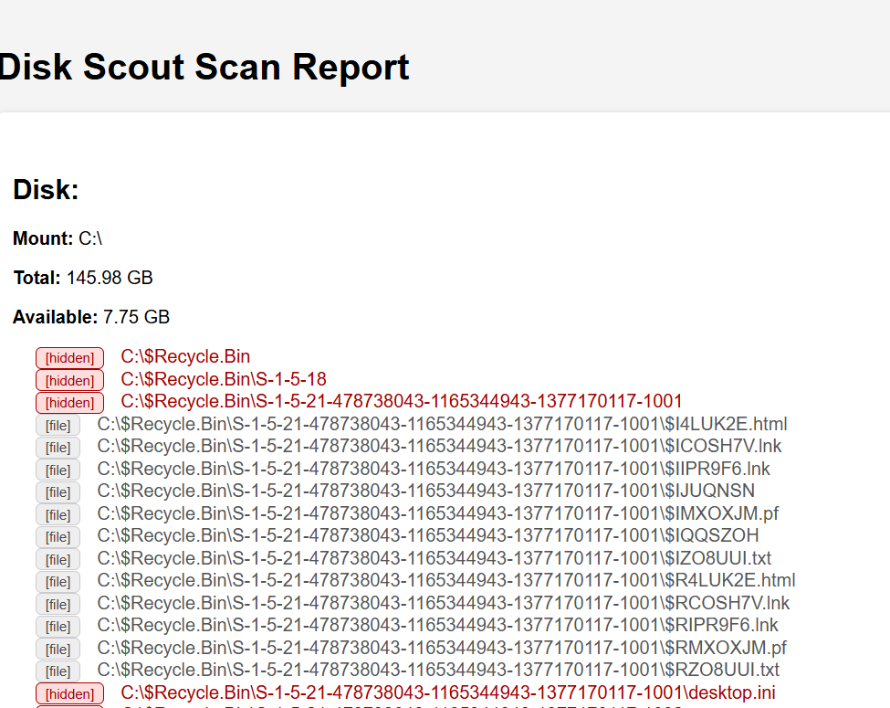

# 🧭 Disk Scout

**Disk Scout** is a lightweight tool built with Rust for scanning Windows disks — including hidden files — and generating a clean, readable HTML report. It optionally adds itself to Windows startup for persistence and runs silently with no console window.

> ⚠️ For ethical use only. Intended for cybersecurity education, red teaming, or system diagnostics.



---

## ✨ Features

- 📂 Recursively scans folders (default: `C:\`)
- 🕵️ Detects hidden files using Windows API flags
- 📄 Outputs results as a human-friendly `output.html`
- 🧼 Silent background execution — no console window
- 🔁 Optional autorun persistence via registry (`HKCU\Software\Microsoft\Windows\CurrentVersion\Run`)
- 🦀 Built in Rust using crates like `winapi`, `walkdir`, and `sysinfo`

---

## 🚀 Usage

### 🛠 Requirements

- [Rust](https://www.rust-lang.org/tools/install)
- Windows OS (10+)

### 📦 Build

```bash
git clone https://github.com/ManU4kym/disk_scout.git
cd disk_scout
cargo build --release --features windows-autorun
```

### ▶️ Run

```bash
cargo run --release --features windows-autorun
```

➡️ Output: `output.html` in the working directory  
📂 Hidden files and folders are marked in red  
🗂 Regular files and directories are categorized

---

## 🧪 How It Works

* Uses `walkdir` to traverse directories
* Hidden files are detected via:
  * `FILE_ATTRIBUTE_HIDDEN` on Windows
  * `.` prefix on Unix (if extended)
* HTML output is styled with tags: `[HIDDEN]`, `[DIR]`, `[FILE]`
* Autorun registry key is added under:

  ```
  HKCU\Software\Microsoft\Windows\CurrentVersion\Run
  ```

---

## 🧠 Example Use Cases

* Security audit of removable drives
* Teaching malware persistence and file enumeration
* Personal system inspection
* Red team tooling (ethical use only)

---

## 📜 License

MIT License — Free to use, modify, and distribute. Attribution appreciated.

---
---

## 🔖 GitHub Repo Settings

**Description**:  
Scan disks for hidden files and generate clean HTML reports using Rust and Windows APIs.

**Tags / Topics**:
```
rust
windows
disk-scanner
cybersecurity
hidden-files
autorun
red-team
sysinfo
walkdir
html-report
```

---

## ⚠️ Disclaimer

This software is intended for **educational and ethical** purposes. Do not deploy, distribute, or execute this tool on machines you do not own or have explicit permission to analyze.  
**Use responsibly.**
